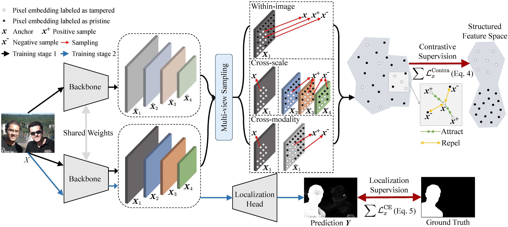

## Exploring Multi-View Pixel Contrast for General and Robust Image Forgery Localization
An official implementation code for paper "[Exploring Multi-View Pixel Contrast for General and Robust Image Forgery Localization](https://ieeexplore.ieee.org/document/10884895)". This repo provides code and trained weights.

## Framework
<p align='center'>  
  
</p>
<p align='center'>  
  <em>Detailed illustration of proposed image forgery localization network MPC. The training process of MPC consists of two stages. In the first stage, we solely train the backbone network to extract discriminative features. Each training sample is fed into the backbone network twice, resulting in multi-scale features from two modalities due to the presence of dropout. Subsequently, a subset of pixel embeddings is sampled from these features, forming a structured feature space under the supervision of three types of contrastive losses. In the second stage, the weights of the backbone network are frozen, and we only train a simple localization head to obtain pixel-wise localization maps. </em>
</p>

## Dependency
- albumentations          1.3.1
- fvcore                  0.1.5.post20221221
- numpy                   1.23.0
- opencv-python           4.8.1.78
- opencv-python-headless  4.9.0.80
- torch                   2.0.0+cu117
- torchsummary            1.5.1
- torchvision             0.8.2+cu110
- python 3.8

### Docker

Pull the PyTorch CUDA image
```bash
docker pull pytorch/pytorch:2.0.0-cuda11.7-cudnn8-devel
```

Run the container interactively, install dependencies, and mount your project directory:
```bash
docker run --gpus all --rm -v ~/projects/:/workspace -it pytorch/pytorch:2.0.1-cuda11.7-cudnn8-devel bash
apt update && apt install libgl1-mesa-glx libglib2.0-0 -y
pip install albumentations==1.3.1 fvcore==0.1.5.post20221221 numpy==1.23.0 opencv-python==4.8.1.78 opencv-python-headless==4.9.0.80 einops timm
```

## Usage

Generate the file list:
```bash
python generate_flist.py
```

For example to train: download [hrt_base.pth](https://www.123684.com/s/2pf9-R1CHv)
```bash
cd CATNet_dataset_train/stage1
python train.py

cd CATNet_dataset_train/stage2
python train.py
```

For example to test: download [MPC_CATNet_stage2_weights.pth](https://www.123684.com/s/2pf9-EGCHv)
```bash
cd CATNet_dataset_train/stage2
python test.py 
```
If you want to test MPC of trained with CASIAv2 dataset, please download the weight file from [MPC_CASIAv2_stage2_weights.pth](https://www.123684.com/s/2pf9-ylCHv) or [MPC_CASIAv2_stage2_weights.pth](https://drive.google.com/file/d/1vXDvrTVizINKcR_MgdA_uuTWcB3I4HdI/view?usp=sharing).

To run inference on a folder of images, use:
```bash
cd CATNet_dataset_train/stage2
python infer.py
```

## Citation
If you use this code for your research, please cite our paper
```
@article{lou2025exploring,
  title={Exploring Multi-View Pixel Contrast for General and Robust Image Forgery Localization},
  author={Lou, Zijie and Cao, Gang and Guo, Kun and Yu, Lifang and Weng, Shaowei},
  journal={IEEE Transactions on Information Forensics and Security},
  year={2025},
  publisher={IEEE}
}
```
## License
Licensed under a [Creative Commons Attribution-NonCommercial 4.0 International](https://creativecommons.org/licenses/by-nc/4.0/) for Non-commercial use only.
Any commercial use should get formal permission first.

## Acknowledgement
This code is based on [FOCAL](https://github.com/HighwayWu/FOCAL). Thanks for their awesome works.


